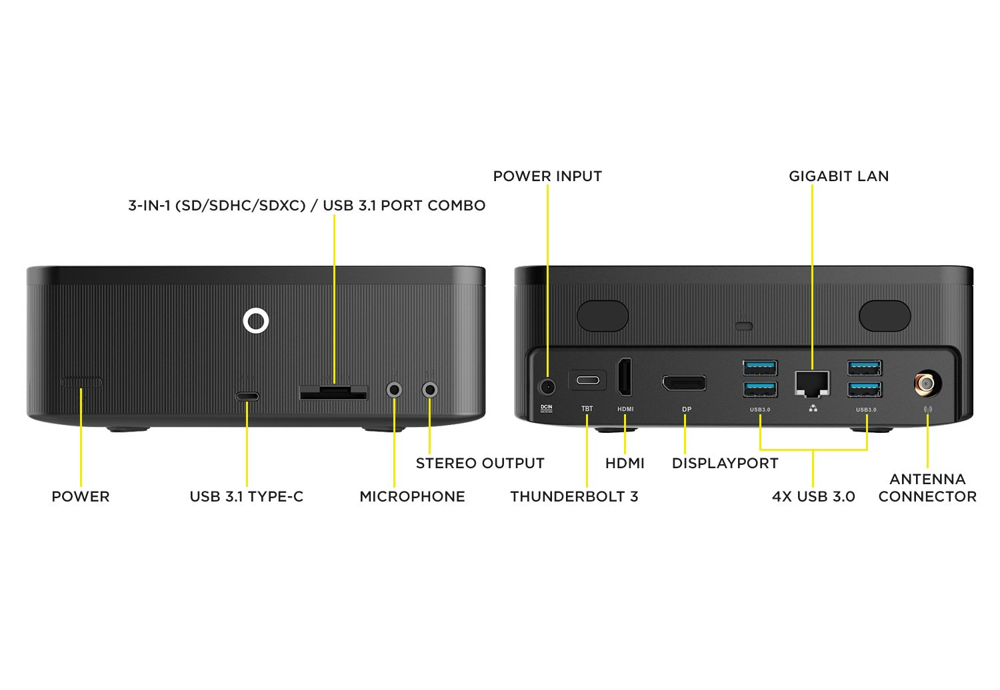

# Zotac ZBOX MI553 Hackintosh Configuration

The Zotac ZBOX MI553 is a very decent subcompact desktop system on the Kaby Lake platform. It has exceptional I/O, featuring a single Thunderbolt 3 port, a single USB-C 3.1 port, HDMI & DisplayPort video out and a compatible SD card reader.

This makes it a perfect Hackintosh platform. I'm surprised it's not more popular, given its pricing of ~350 USD.

## Hardware Info & Specs
- CPU: Intel i5-7300HQ (4C4T Kaby Lake)
- Memory: DDR4 SODIMM, Supports Up to 64GB (2x 32G)
- Storage:
    - 1x SATA @ SATA 3.0
    - 1x M.2/NGFF M-key 22/42 Only @ SATA 3.0
    - 1x M.2/NGFF M-key 22/42, 60, 80 @ PCIe 3.0 x4 (NVMe)
- Networking:
    - Wired: Intel I219-LM
    - Wireless: Intel Wireless 3165
- Graphics: Intel HD 630
- Sound: Intel CM238 HD Audio Controller with Realtek ALC892 codec
- I/O:
    - USB A (x4)
    - USB C (x1) - 3.1 speed
    - Thunderbolt 3 (x1)
    - SD Card Reader (On USB3 Bus)
    - HDMI (x1)
    - DisplayPort (x1)

Notes:
- Internal wifi is NGFF and removable (voids warranty)
- Default wifi card's BT function is over USB so it works fine despite wifi not working
- iGPU can properly use memory

Please see [Hardware](hw.md) for more info including images on the internals.

## Kexts Used
- Lilu
- VirtualSMC
- WhateverGreen
- AppleALC
    - `alcid=31` tested to work
- IntelMausiEthernet

## Bugs
- Thunderbolt is Alpine Ridge so _should_ be workable but currently untested.
