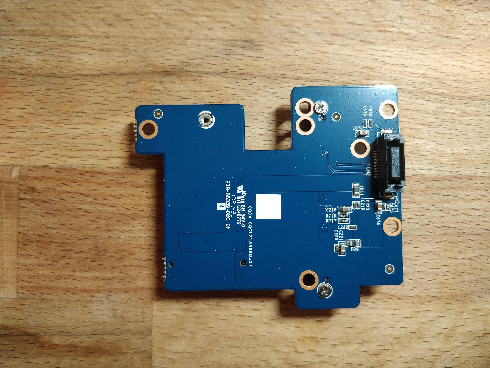

# Hardware Details
Here are some details about the hardware.

## Semi-Stripped mainboard

This is an image of the semi-stripped mainboard. You can see that the WIFI Card
is removable. Some other points of interest: The DisplayPort connector is on
something that looks really like an M.2 M-Key slot. There's a buzzer.

## Thunderbolt card

What sorcery is this?? Apparently this is an M.2 to Thunderbolt 3 card. It
appears to be using an M.2 M-Key connector.

Whether it's electrically M.2 is unknown but I have some doubts. The connector
must be providing the DP signal somehow. In fact, on the mainboard, the DP
connector is on a similar daughterboard connected via M.2 M-key.

If this is a standard M.2 PCIe x4 card, this would potentially give rise to
adding Thunderbolt support to almost any mini-PC with M.2 availability.
Truly black magic...

## SATA Daughterboard

This is the daughterboard for the two SATA devices. Removing it requires voiding
the warranty sticker.
